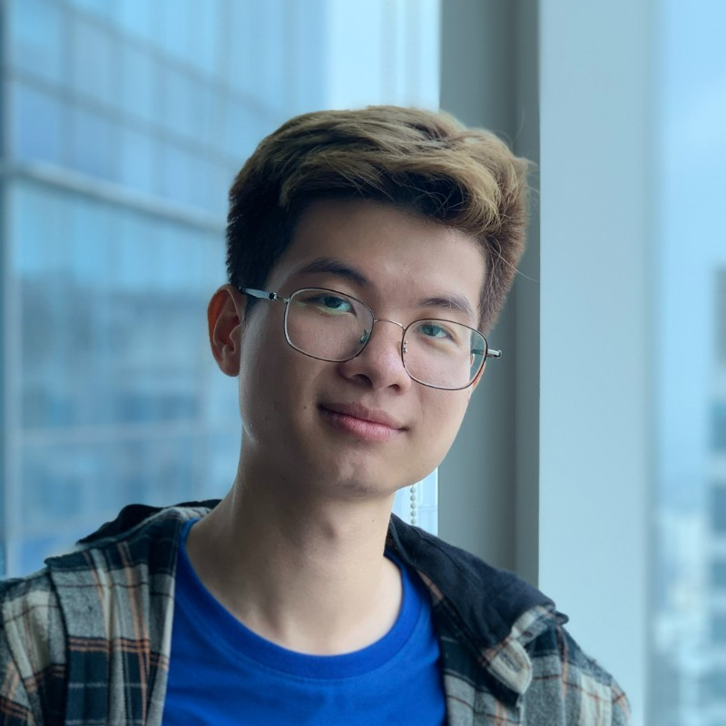

<!--  -->

<!-- I'm **Anh Duy TRAN (MSE, CHFI)**. I am a Master (MSE) in **Communication System Security** at [**EURECOM**](https://www.eurecom.fr/en) and [**Télécom Paris**](https://www.telecom-paris.fr/en/home) in France. My research focuses include many subjects in Computer and System Security, mostly in **Computer Forensics**, **Mobile System Security, Privacy** and **Software Security**. I work to help organizations to inspect digital evidence in the cyber-crime investigation process, to design secured systems and software.  -->

I am a Ph.D. researcher in the research group [**DistriNet**](https://distrinet.cs.kuleuven.be/) at the Computer Science department of **KU Leuven**, under the supervision of [**Prof. Wouter Joosen**](https://distrinet.cs.kuleuven.be/people/WouterJoosen) and [**Prof. Koen Yskout**](https://www.distrinet.cs.kuleuven.be/people/KoenYskout).
My research focuses include various subjects in Computer and System Security, mostly in Software Security, Computer and Multimedia Forensics, Malware Analysis, Mobile Security, Privacy.
I obtained a Diplôme d'ingénieur (Master of Science in Engineering) **Communication System Security** at [**EURECOM**](https://www.eurecom.fr/en) and [**Télécom Paris**](https://www.telecom-paris.fr/en/home) in France. My Master's thesis is about Memory Forensics, under the supervision of [**Prof. Davide Balzarotti**](http://s3.eurecom.fr/~balzarot/).
I am the founder of [**Computer Security Club**](https://www.facebook.com/hcmus.compsec.club) at University of Science, VNU-HCM. I sometimes play CTF with the codename **pakkunandy**, and I also host HCMUS-CTF every year.

<!---
I am currently involved in memory forensics research with Prof. [Davide Balzarotti](http://s3.eurecom.fr/~balzarot/). Besides, I am a lecturer and a researcher in Computer Security in [VNU-HCMUS](https://en.hcmus.edu.vn/). In my free time, I play CTF with [NOPS](http://www.s3.eurecom.fr/nops/index.html) team, EURECOM. 
-->

# Contact Information
* **Email**   : anh-duy.tran (at) kuleuven (dot) be
* **Resume**  : [PDF](./assets/pdf/Anh-Duy-Tran-CV.pdf) (please email me for full version)
* **Twitter** : [@pakkunandy](https://twitter.com/pakkunandy)
* **Linkedin**: [Anh Duy TRAN](https://www.linkedin.com/in/anh-duy-tran/)
* **Github**  : [pakkunandy](https://github.com/pakkunandy)

# Research
My research interests include

* Secure Software Development
* Computer and Multimedia Forensics.
* Mobile System Security and Privacy.
* Software Security.
* Social Engineering.

My research style is interdisciplinary in general. I am leveraging many techniques and knowledge from many domains to tackle real-world security-related problems and design secure systems. I am currently involved in [Multimedia Verification](https://github.com/fotoverifier/fotoverifier) projects with [Prof. Dang-Nguyen Duc-Tien](https://dnductien.github.io/). 

# Professional Activities
* I am a member of the Workshop Program Chair of [SCID](https://www.scid.tech/) @ Asia CCS 2024.
* I am an organizing member of [Grand Challenge on Detecting Cheapfakes](https://detecting-cheapfakes.github.io/icmr-2024.html) @ [ICMR 2024](https://icmr2024.org/).
* I am a PC member of [SecDev 2024](https://secdev.ieee.org/2024/home), [ICMR 2024](https://icmr2024.org/), [MAPR 2024](https://mapr.uit.edu.vn/), [SoICT 2023](https://soict.org/2023/).
* I am an AEC member of [ISSTA 2024](https://2024.issta.org/committee/issta-2024-artifact-evaluation-artifact-evaluation-committee).
* I am a web chair of [MMM 2023](https://www.mmm2023.no/organisation).
* I am a reviewer at [MMM 2023](https://www.mmm2023.no/), [MAPR 2023](https://mapr.uit.edu.vn/2023/).

# Teaching
Teaching assistant at imec-DistriNet, KU Leuven
* Software Architecture

Lecturer and Teaching Assistant at the Faculty of Information Technology in VNUHCM-University of Science
* Computer and Software Security
* Cryptography and application
* Mobile Development
* Communication Management
* Software Design
* Software Requirements Specification 
* Software Testing 
* Software Engineering
* Software Architecture
* Scientific Research Methodologies
* Technical Writing
* Java Application Development
* Introduction to AI

I am a founder and manager of the [Computer Security Club - HCMUS](https://www.facebook.com/hcmus.compsec.club)
# Academic Awards and Prizes, Certification
* Best paper award at QRS 2023.
* The Oustanding Young Lecturer, VNUHCM-University of Science.
* Computer Hacking Forensic Investigator-CHFI certificate by EC-Council 
* Eiffel Excellent Scholarship for Engineering Students.
* Top 1/500 students of the Regular Program (intake 2012).
* Certificate: Rank 1st Graduation Regular Program (intake 2012).
* Certificate of Merit of Excellence graduation in Software Engineering - University of Science.
* Special prize of "Master Key" Contest - Ho Chi Minh City.
* Gold Medal of "Designing - Manufacturing - Application" Contest – Ho Chi Minh City
* Second Prize in National Competition for Innovation of Students XVIII - Euréka.
* Consolation prize of 25th Young Information Technology Contest – Ho Chi Minh City.
* Studio 60 Scholarship.
* ATHENA "White Hat Hacker" Training Scholarship
* Sunflower Mission Engineering and Technology Scholarship
* CSC Vietnam Scholarship

# Experiences
* Security Consultant, part-time job at the InspireLab, Vietnam.
* Security Consultant, part-time job at KiteMetric, Vietnam.
* Memory Forensics Internship at EURECOM, France.
* Android Development Internship at NEC, Vietnam.

# Publications

