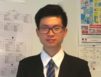

I'm **Anh Duy TRAN (MSE, CHFI)**. I am a Master (MSE) in **Communication System Security** at [**EURECOM**](https://www.eurecom.fr/en) and [**Télécom Paris**](https://www.telecom-paris.fr/en/home) in France. My research focuses include many subjects in Computer and System Security, mostly in **Computer Forensics**, **Mobile System Security, Privacy** and **Software Security**. I work to help organizations to inspect digital evidence in the cyber-crime investigation process, to design secured systems and software. I am currently involved in memory forensics research with Prof. [Davide Balzarotti](http://s3.eurecom.fr/~balzarot/). Besides, I am a lecturer and a researcher in Computer Security in [VNU-HCMUS](https://en.hcmus.edu.vn/). In my free time, I play CTF with [NOPS](http://www.s3.eurecom.fr/nops/index.html) team, EURECOM. 

# Contact Information
* **Email**   : tranad (at) eurecom (dot) fr
* **Resume**  : [PDF](./assets/pdf/Anh-Duy-Tran-CV.pdf) (please email me for full version)
* **Twitter** : [@pakkunandy](https://twitter.com/pakkunandy)
* **Linkedin**: [Anh Duy TRAN](https://www.linkedin.com/in/anh-duy-tran/)
* **Github**  : [pakkunandy](https://github.com/pakkunandy)

# Research
My research interests include

* Computer Forensics: OS forensics and Memory Forensics.
* Imaging Security and Forensics.
* Mobile System Security and Privacy.
* Software Security.
* Social Engineering.
* Applied Cryptography: Searchable Encryption
* Penetration Testing.
* IoT and Hardware Security.

My research style is interdisciplinary in general. I am leveraging many techniques and knowledge from many domains to tackle real-world security-related problems and design secured system. I am currently involved in designing a secured system architecture for annotation project in my university with Prof. [Minh-Triet Tran](https://www.fit.hcmus.edu.vn/~tmtriet/). Besides, I also work remotely in memory forensics project.

# Teaching

Lecturer and Teaching assistant at Falculty of Information Technology in VNUHCM-University of Science
* Computer and Software Security
* Cryptography and application
* Mobile Development
* Communication Management
* Software Design
* Software Requirements Specification 
* Software Testing 
* Software Engineering
* Software Architecture
* Scientific Research Methodologies
* Technical Writing
* Theory of Automata and Formal Languages
* Logic Programming
* Java Application Development
* Introduction to AI

I am a founder and manager of the [Computer Security Club - HCMUS](https://www.facebook.com/hcmus.compsec.club)
# Academic Awards and Prizes, Certification
* Computer Hacking Forensic Investigator-CHFI certificate by EC-Council 
* Eiffel Excellent Schlarship for Engineering Student.
* Top 1/500 students of the Regular Program (intake 2012).
* Certificate: Rank 1st Graduation Regular Program (intake 2012).
* Certificate of Merit of Excellence graduation in Software Engineering - University of Science.
* Special prize of "Master Key" Contest - Ho Chi Minh City.
* Gold Medal of "Designing - Manufacturing - Application" Contest – Ho Chi Minh City
* Second Prize in National Competition for Innovation of Students XVIII - Euréka.
* Consolation prize of 25th Young Information Technology Contest – Ho Chi Minh City.
* Studio 60 Scholarship.
* ATHENA "White Hat Hacker" Training Scholarship
* Sunflower Mission Engineering and Technology Scholarship
* CSC Vietnam Scholarship

# Experiences
* Security Consultant, part time job at KiteMetric, Vietnam.
* Memory Forensics Internship at EURECOM, France.
* Android Developement Internship at NEC, Vietnam.
